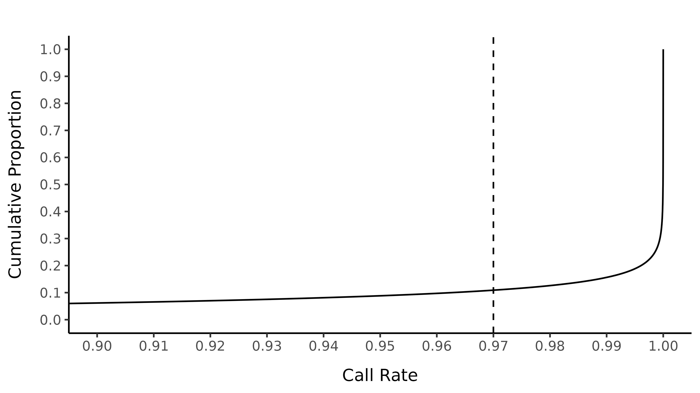
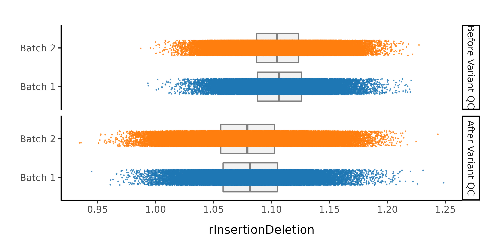
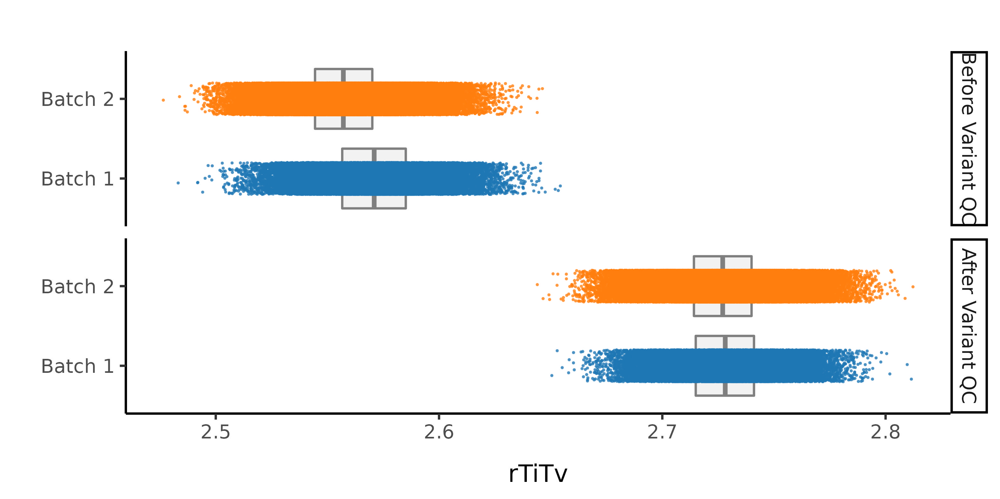
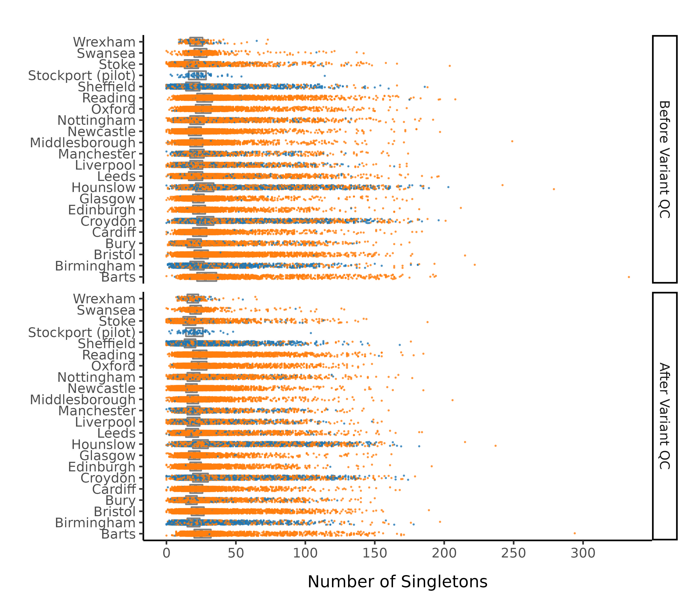

```{r setup, include=FALSE, warning=FALSE}
knitr::opts_chunk$set(echo = TRUE)

require(plotly)
require(crosstalk)
require(data.table)
require(dplyr)
require(DT)
require(kableExtra)
require(formattable)
require(htmltools)
source("../QC_scripts/utils/r_options.r")
source("../QC_scripts/utils/helpers.r")

options(dplyr.summarise.inform=F)
```
 <br>
On this page we detail the quality control (QC) pipeline for the UK Biobank exomes before starting our analyses. Further plots and the underlying [code](https://github.com/astheeggeggs/SAIGE_gene_munging/tree/main/QC_scripts) can be found on the SAIGE gene munging github [repository](https://github.com/astheeggeggs/SAIGE_gene_munging).

We first summarise the collection of samples for which the exome sequence data is available, splitting across UKBB centres and sequencing batch.

```{r sample_composition, echo=FALSE, out.width = '100%', warning=FALSE}
dt_pheno <- create_pheno_dt(TRANCHE)
dt_pheno <- dt_pheno %>% mutate(ukbb_centre = as.character(ukbb_centre)) %>% mutate(ukbb_centre = ifelse(is.na(ukbb_centre), "Unknown", ukbb_centre)) %>% mutate(`UKBB centre` = ukbb_centre)

dt_loc <- dt_pheno %>% group_by(`UKBB centre`) %>% 
  summarize("Batch 1" = sum(sequencing_batch=="Batch 1", na.rm=TRUE),
            "Batch 2" = sum(sequencing_batch=="Batch 2", na.rm=TRUE),
            "Total"=sum(!is.na(sequencing_batch)))
dt_loc <- rbind(dt_loc, c("Total", colSums(dt_loc[,2:ncol(dt_loc)])))

dt_loc %>%
  kable("html", escape=FALSE, format.args = list(big.mark = ",")) %>% row_spec(0,bold=TRUE) %>%
  row_spec(nrow(dt_loc), bold = T, color = "white", background = "#c24100") %>% 
  kable_styling('hover', font_size=12)

```
<br>


Finally, the split by [Data-Field 21000](https://biobank.ndph.ox.ac.uk/showcase/field.cgi?id=21000) was as follows:

```{r sample_composition_PI, echo=FALSE, out.width = '100%', warning=FALSE}

dt_loc <- dt_pheno %>% group_by(self_report_ethnicity) %>% 
    summarize("Batch 1" = sum(sequencing_batch=="Batch 1", na.rm=TRUE),
              "Batch 2" = sum(sequencing_batch=="Batch 2", na.rm=TRUE),
              "Total"=sum(!is.na(sequencing_batch)))
dt_loc <- rbind(dt_loc, c("Total", colSums(dt_loc[,2:ncol(dt_loc)])))

dt_loc %>%
  kable("html", escape=FALSE, format.args = list(big.mark = ",")) %>% 
  row_spec(nrow(dt_loc), bold = T, color = "white", background = "#c24100") %>% row_spec(0, bold=TRUE) %>%
  kable_styling('hover', font_size=11)

```

<br> 

For our QC pipeline, we first perform a collection of careful [QC steps](https://github.com/lindgrengroup/ukb_wes_qc). The initial step in this process is to read in the `.vcf` files, split multiallelics and realign indels, and calculate a collection of sample-level statistics. 

# Initial sample filtering

* Filter out samples based on MAD thresholds.

<br>

# Initial genotype filtering

Our next step (after conversion of the joint called `.vcf` file to a hail matrix table) is to remove genotypes based on the following collection of criteria:

* If homozygous reference, remove if at least one of the following is true:
    + Genotype quality $<$ 20
    + Depth $<$ 10

* If heterozygous, at least one of the following is true:
    + (Reference allele depth + alternative allele depth) divided by total depth $<$ 0.8
    + Alternative allele depth divided by total depth $<$ 0.2
    + Reference phred-scaled genotype posterior $<$ 20
    + Depth $<$ 10

* If homozygous variant, at least one of the following is true:
    + Alternative allele depth divided by total depth $<$ 0.8
    + Reference phred-scaled genotype posterior $<$ 20
    + Depth $<$ 10

<br>

# Initial variant filtering

Remove variants that either:

*  Are invariant after the initial GT filter
*  Fall in a low complexity region
*  Fall outside padded target intervals (50bp padding)
*  Have GATK ExcessHet > 54.69

<br>

Following this initial curation we perform a series of further QC steps detailed in this repository.

We run the sample_qc function in hail and remove samples according to the following:

* Sample call rate $<$ `r T_sample_callRate`
* Mean depth $<$ `r T_dpMean`
* Mean genotype quality $<$ `r T_gqMean`

Thresholds used were based on plotting the distributions of these metrics. Here we show boxplots with overlaid scatterplots of the above metrics, split by UKBB centre, and coloured by sequencing batch. The threshold for exclusion is shown as a dashed line.

```{r init_samples, echo=FALSE, out.width = '100%', warning=FALSE}
# knitr::include_graphics("../plots/200k_03_callRate_by_centre.jpg")
# knitr::include_graphics("../plots/200k_03_dpMean_by_centre.jpg")
# knitr::include_graphics("../plots/200k_03_gqMean_by_centre.jpg")
```

```{r sample_table, echo=FALSE, out.width = '100%', warning=FALSE}

dt <-fread(paste0("/well/lindgren/UKBIOBANK/dpalmer/wes_", TRANCHE, "/ukb_wes_qc/data/samples/03_sample_count.tsv"), header=FALSE)
names(dt) <- c("Filter", "Samples", "Batch 1", "Batch 2")

dt[,"%"] <- round(100 * dt$Samples/dt$Samples[1], 1)

dt %>% mutate("%" = color_bar("#0081c2")(unlist(dt[,'%']))) %>% 
  kable("html", escape=FALSE, align=c('l', 'r', 'r', 'r', 'r'), format.args = list(big.mark = ",")) %>% row_spec(0,bold=TRUE) %>%
  row_spec(nrow(dt), bold = T, color = "white", background = "#c24100") %>% 
  kable_styling('hover')

```

Following this step, we export genotyped variants on the X chromosome (allele frequency between 0.05 to 0.95 with high call rate (> 0.98)) to plink format and prune to pseudo-independent SNPs using `--indep 50 5 2`. This pruned set of SNPs feeds into the sex imputation step.

<br>

# Sex imputation

We impute the sexes of the individuals with this pruned set of variants on the X chromosome, and create list of samples with incorrect or unknown sex as defined by:

* Sex is unknown in the phenotype files
* F-statistic $>$ `r T_impute_sex` and the sex is female in the phenotype file
* F-statistic $<$ `r T_impute_sex` and the sex is male in the phenotype file
* DEV: check definition used

Here we show the distribution of the F-statistic, with the `r T_impute_sex` threshold defining our sex impututation shown as a dashed line.

```{r impute_sex, echo=FALSE, out.width = '100%', warning=FALSE}
# knitr::include_graphics("../plots/04_imputesex_histogram.jpg")
# knitr::include_graphics("../plots/04_imputesex_scatter_box.jpg")
```

```{r sample_sex_removal_table, echo=FALSE, out.width = '100%', warning=FALSE}

# Note that in these two tables, dt is the table that is displayed after the boxplots on webpage.

sex_removed <- fread(paste0("/well/lindgren/UKBIOBANK/dpalmer/wes_", TRANCHE, "/ukb_wes_qc/data/samples/04_sexcheck.remove.sample_list"), header=FALSE)
dt_sex_removed <- dt_pheno[which(dt_pheno$s %in% sex_removed$V1),]
n_sex_removed <- c(nrow(dt_sex_removed),
                   nrow(dt_sex_removed %>% filter(sequencing_batch == "Batch 1")),
                   nrow(dt_sex_removed %>% filter(sequencing_batch == "Batch 2")))

# This is the number of samples after the initial round of sample QC filters.
n_before <- dt[nrow(dt),2:4]
# This is the number after then removing the samples removed due to sex-swaps.
n_after_sex_removed <- n_before - n_sex_removed

dt_sex_removal <- rbindlist(
    list(dt[nrow(dt),],
        list(c("Samples with sex swap", "Samples after sex swap removal"),
             c(n_sex_removed[1], n_after_sex_removed$Samples),
             c(n_sex_removed[2], n_after_sex_removed$`Batch 1`),
             c(n_sex_removed[3], n_after_sex_removed$`Batch 2`),
             c(round(n_sex_removed[1] / unlist(dt[nrow(dt),2]) * 100,1),
               round(n_after_sex_removed$Samples / unlist(dt[nrow(dt),2]) * 100,1)))), use.names=FALSE)

dt_sex_removal[1,5] <- 100
dt_sex_removal %>% mutate("%" = color_bar("#0081c2")(unlist(dt_sex_removal[,'%']))) %>% 
  kable("html", escape=FALSE, align=c('l', 'r', 'r', 'r', 'r'), format.args = list(big.mark = ",")) %>% row_spec(0,bold=TRUE) %>%
  row_spec(nrow(dt_sex_removal), bold = T, color = "white", background = "#c24100") %>% 
  kable_styling('hover')
```

<br>

# PCA

We next perform a number of principal component analysis (PCA) steps to ensure that we have subset down to Non-Finnish Europeans.

<br>

## PCA including 1000 genomes

Next, we included the 1000 genomes samples (minus the small subset of related individuals within 1000 geneomes), and rerun PCA after including those individuals. Plots of the first six principal components are shown below. 1000 genomes samples are coloured in dark blue.

```{r pca_1kg, echo=FALSE, out.width = '100%', warning=FALSE}
# knitr::include_graphics("QC_plots/10_PC1_PC2_1kg_collection.jpg")
# knitr::include_graphics("QC_plots/10_PC3_PC4_1kg_collection.jpg")
# knitr::include_graphics("QC_plots/10_PC5_PC6_1kg_collection.jpg")
```

We first train a classifier to remove non-Europeans. To do this, we train a random forest on the super populations labels of 1000 genomes and predict the super population for each of the UK Biobank samples. We denote strictly defined European subset as those with probability $>$ `r T_European_RF` of being European according to the classifier. UK Biobank samples are coloured by their assignment or unsure if none of the classifier probabilities exceeded `r T_European_RF` in the following plots. Another classifier is trained following restriction of the 1000 genomes samples to Europeans to determine non-Finnish Europeans, using a classifier probability of `r T_Finnish_RF`.

```{r pca_1kg_class_EUR_strict, echo=FALSE, out.width = '100%', warning=FALSE}
# knitr::include_graphics("QC_plots/10_PC1_PC2_classify_EUR_strict.jpg")
# knitr::include_graphics("QC_plots/10_PC3_PC4_classify_EUR_strict.jpg")
# knitr::include_graphics("QC_plots/10_PC5_PC6_classify_EUR_strict.jpg")
```

```{r sample_PC_table, echo=FALSE, warning=FALSE, message=FALSE, out.width = '100%'}

# PCA_SCORES <- 'gsutil cat gs://dalio_bipolar_w1_w2_hail_02/data/samples/09_pca_scores.tsv'
# EUROPEAN_SAMPLES_STRICT <- "../samples_BipEx/10_european.strict.sample_list"
# EUROPEAN_SAMPLES_LOOSE <- "../samples_BipEx/10_european.loose.sample_list"

# dt_pca <- fread(PCA_SCORES, sep='\t', stringsAsFactors=FALSE, header=TRUE, data.table=FALSE)
# eur_strict <- fread(EUROPEAN_SAMPLES_STRICT, stringsAsFactors=FALSE, header=FALSE, data.table=FALSE)
# eur_loose <- fread(EUROPEAN_SAMPLES_LOOSE, stringsAsFactors=FALSE, header=FALSE, data.table=FALSE)

# dt_pca_merged <- merge(dt_pca, (dt_pheno %>% rename(s = SAMPLE_ALIAS)), by='s')

# dt_pca_case <- dt_pca_merged %>% filter(PHENOTYPE_COARSE_NEW == "Bipolar Disorder")
# dt_pca_control <- dt_pca_merged %>% filter(PHENOTYPE_COARSE_NEW == "Control")

# dt <- data.table(Filter = c("Initial samples", "Non-European, strict filter",
#     "Non-European, loose filter", "Samples after strict European filter"),
#     Samples = c(nrow(dt_pca),
#         nrow(dt_pca[which(!(dt_pca$s %in% eur_strict$V1)),]),
#         nrow(dt_pca[which(!(dt_pca$s %in% eur_loose$V1)),]),
#         nrow(dt_pca[which((dt_pca$s %in% eur_strict$V1)),])),
#     'Bipolar cases' = c(nrow(dt_pca_case),
#         nrow(dt_pca_case[which(!(dt_pca_case$s %in% eur_strict$V1)),]),
#         nrow(dt_pca_case[which(!(dt_pca_case$s %in% eur_loose$V1)),]),
#         nrow(dt_pca_case[which((dt_pca_case$s %in% eur_strict$V1)),])),
#     Controls = c(nrow(dt_pca_control),
#         nrow(dt_pca_control[which(!(dt_pca_control$s %in% eur_strict$V1)),]),
#         nrow(dt_pca_control[which(!(dt_pca_control$s %in% eur_loose$V1)),]),
#         nrow(dt_pca_control[which((dt_pca_control$s %in% eur_strict$V1)),])))

# dt[,"%"] <- round(100 * dt$Samples/dt$Samples[1], 1)

# dt %>% mutate("%" = color_bar("#0081c2")(unlist(dt[,'%']))) %>% 
#   kable("html", escape=FALSE, align=c('l', 'r', 'r', 'r', 'r'), format.args = list(big.mark = ",")) %>% row_spec(0,bold=TRUE) %>%
#   row_spec(nrow(dt), bold = T, color = "white", background = "#c24100") %>% 
#   kable_styling('hover')

```

Samples not assigned to the Non-Finnish European cluster were removed from downstream analysis.

<br>

# Ultra-rare variant counts

# DEV: need to include these.

# Final variant filtering

For our final variant filtering step, we first restrict to samples in the strictly defined non-Finnish European subset, filter out samples with incorrectly defined sex or unknown sex, and run variant QC. We then evaluate a collection of variant metrics and remove variants that satisfy at least one of:

* Invariant site in cleaned sample subset
* Call rate $<$ `r T_variant_call_rate`
* _p_HWE $<$ 10^-6^

The following plot shows the `r T_variant_call_rate` threshold for call rate.

```{r final_variant, echo=FALSE, out.width = '100%', warning=FALSE}
# 
```

```{r variant_final_table, echo=FALSE, out.width = '100%', warning=FALSE}

# dt <- fread('../samples_BipEx/14_variant_count.tsv', header=FALSE)
# names(dt) <- c("Filter", "Variants")
# dt[,"%"] <- round(100 * dt$Variants/dt$Variants[1], 1)

# dt %>% mutate("%" = color_bar("#0081c2")(unlist(dt[,'%']))) %>% 
#   kable("html", escape=FALSE, align=c('l', 'r', 'r'), format.args = list(big.mark = ",")) %>% row_spec(0,bold=TRUE) %>%
#   row_spec(nrow(dt), bold = T, color = "white", background = "#c24100") %>% 
#   kable_styling('hover')

```

After these steps we plot the resulting changes in metrics across the samples in our data set. Each of this first set plots splits the data by sequencing batch. The first collection of subplots in each figure shows the variant metrics before sample removal, with the lower collection of subplots showing the resultant change after our QC steps.
```{r final_sample, echo=FALSE, out.width = '100%', warning=FALSE}
# knitr::include_graphics("../plots/09_nSingletons_by_batch.jpg")
# knitr::include_graphics("../plots/09_rHetHomVar_by_batch.jpg")
# 
# 
```
Splitting by UKBB centre and colouring by sequencing batch:

```{r final_sample_centre, echo=FALSE, out.width = '100%', warning=FALSE}
# 
# knitr::include_graphics("../plots/09_rHetHomVar_by_centre.jpg")
# knitr::include_graphics("../plots/09_rInsertionDeletion_by_centre.jpg")
# knitr::include_graphics("../plots/09_rTiTv_by_centre.jpg")
```

<br>

# Final sample filtering

In this step we remove sample outliers after the variant cleaning in the previous step. Samples are removed if at least one of the following lies more than four standard deviations away from the mean:

* Ratio of transitions to transversions
* Ratio of heterozygous to homozygous variant
* Ratio of insertions to deletions

We also remove samples with over 175 singletons in the dataset.

```{r variant_sample_table, echo=FALSE, out.width = '100%', warning=FALSE}

# dt <- fread('../samples_BipEx/15_sample_count.tsv', header=FALSE)
# names(dt) <- c("Filter", "Samples", "Bipolar Cases", "Controls")
# dt[,"%"] <- round(100 * dt$Samples/dt$Samples[1], 1)

# dt %>% mutate("%" = color_bar("#0081c2")(unlist(dt[,'%']))) %>% 
#   kable("html", escape=FALSE, align=c('l', 'r', 'r', 'r', 'r'), format.args = list(big.mark = ",")) %>% row_spec(0,bold=TRUE) %>%
#   row_spec(nrow(dt), bold = T, color = "white", background = "#c24100") %>% 
#   kable_styling('hover')

```

<br>

After all of this data cleaning, we save the resultant hail matrix tables for downstream analyses.

The resultant composition of the samples according to UKBB centre was as follows:

```{r final_sample_composition, echo=FALSE, out.width = '100%', warning=FALSE}

# dt_final_samples <- fread("gsutil cat gs://dalio_bipolar_w1_w2_hail_02/data/samples/17_final_qc.samples.tsv.bgz | gzcat")

# dt_loc <- dt_final_samples %>% group_by(LOCATION) %>% 
#   summarize("Bipolar Disorder" = sum(PHENOTYPE_COARSE=="Bipolar Disorder"),
#             "Schizoaffective" = sum(PHENOTYPE_COARSE=="Schizoaffective"),
#             "Schizophrenia" = sum(PHENOTYPE_COARSE=="Schizophrenia"),
#             "Other" = sum(PHENOTYPE_COARSE=="Other"),
#             "Unknown" = sum(PHENOTYPE_COARSE=="Unknown"),
#             "Controls" = sum(PHENOTYPE_COARSE=="Control"),
#             "Total"=n())
# dt_loc <- rbind(dt_loc, c("Total", colSums(dt_loc[,2:ncol(dt_loc)])))

# fwrite(dt_loc, file="../phenotype_data/17_phenotypes_and_location_summary.tsv", row.names=FALSE, sep='\t')
# dt_loc <- fread("../phenotype_data/17_phenotypes_and_location_summary.tsv") %>% rename(Location=LOCATION)
# dt_loc %>%
#   kable("html", escape=FALSE, format.args = list(big.mark = ",")) %>% row_spec(0,bold=TRUE) %>%
#   row_spec(nrow(dt_loc), bold = T, color = "white", background = "#c24100") %>%  
#   kable_styling('hover', font_size=12)

```

The composition by sequencing batch was as follows:

```{r final_sample_subtype_composition, echo=FALSE, out.width = '100%', warning=FALSE}

# dt_loc <- dt_final_samples %>% group_by(LOCATION) %>% 
#     summarize("Bipolar Disorder 1" = sum(PHENOTYPE_FINE == "Bipolar Disorder 1"),
#               "Bipolar Disorder 2" = sum(PHENOTYPE_FINE == "Bipolar Disorder 2"),
#               "Bipolar Disorder NOS" = sum(PHENOTYPE_FINE == "Bipolar Disorder NOS"),
#               "Schizoaffective" = sum(PHENOTYPE_FINE == "Schizoaffective"),
#               "Bipolar Total (including schizoaffective)" = sum(
#                 PHENOTYPE_COARSE == "Bipolar Disorder" |
#                 PHENOTYPE_COARSE == "Schizoaffective"
#                 ),
#               "Controls" = sum(PHENOTYPE_FINE == "Control"))
# dt_loc <- rbind(dt_loc, c("Total", colSums(dt_loc[,2:ncol(dt_loc)])))
# fwrite(dt_loc, file="../phenotype_data/17_subphenotypes_and_location_summary.tsv", row.names=FALSE, sep='\t')
# dt_loc <- fread("../phenotype_data/17_subphenotypes_and_location_summary.tsv") %>% rename(Location=LOCATION)
# dt_loc$Total = rowSums(dt_loc[,c("Controls", "Bipolar Total (including schizoaffective)")])

# dt_loc %>%
#   kable("html", escape=FALSE, format.args = list(big.mark = ",")) %>% row_spec(0,bold=TRUE) %>%
#   row_spec(nrow(dt_loc), bold = T, color = "white", background = "#c24100") %>%  
#   kable_styling('hover', font_size=12)

```
